# Cómo Crear una Conexión de Node-RED con InfluxDB y Grafana

Primero descargamos Node.js desde su página oficial: [Descargar Node.js](https://nodejs.org/en)

Después podremos descargar Node-RED desde su página oficial siguiendo los pasos (hay que tener en cuenta qué sistema operativo tenemos instalado en nuestro computador para poder instalar el correcto). En este ejemplo, usaremos un sistema operativo Windows, por lo cual lo instalaremos con `npm`. Para esto, abre una ventana de comandos (`cmd`). Para abrirla:
- Pulsa el botón de Windows en la esquina inferior izquierda de la pantalla y escribe "cmd".
- O utiliza `Windows + R` y escribe "cmd".

Sigue las instrucciones de instalación en: [Guía de instalación de Node-RED](https://nodered.org/docs/getting-started/local)

Una vez instalado, podemos ejecutarlo. Escribe `node-red` en la misma ventana de comandos para iniciar el programa.

Cuando el programa haya iniciado, abre tu navegador de preferencia y accede a tu dirección IP (la que usaremos para la red de PLCs) y el puerto de Node-RED. Por ejemplo: `http://192.168.0.1:1880`. Node-RED también muestra un ejemplo con la IP interna del dispositivo:

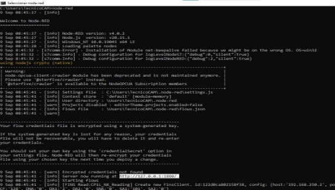

Una vez en la página de Node-RED, necesitaremos añadir unas paletas que permitan la comunicación con InfluxDB. Usa la paleta proporcionada en esta guía para asegurarte de la compatibilidad:
- Paleta de InfluxDB: [node-red-contrib-influxdb](https://flows.nodered.org/node/node-red-contrib-influxdb)

---

## Instalación de InfluxDB

Descargamos InfluxDB desde su página oficial: [Descargar InfluxDB](https://www.influxdata.com/downloads/). **Nota:** Nos pedirán un nombre de usuario y un correo electrónico asociado, que debemos recordar para pasos posteriores.

Selecciona la plataforma adecuada (en este ejemplo, Windows) y copia el código de descarga proporcionado para ejecutarlo en `PowerShell`.

Para abrir `PowerShell`, presiona el botón de Windows, escribe "PowerShell" o usa `Ctrl + R` y escribe "PowerShell". Una vez abierto, pega el código de descarga y espera a que se complete:

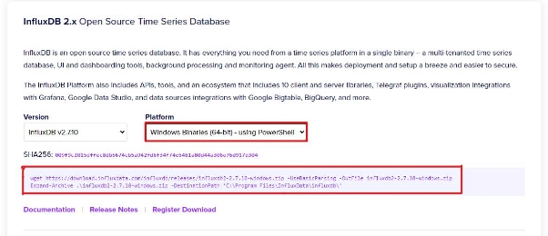

**Nota:** Esta guía utiliza InfluxDB 2.7.10. Versiones futuras, como las 3.X, podrían requerir pasos diferentes.

Una vez descargado, abre `cmd`, navega al directorio donde se encuentra el ejecutable (`C:\Program Files\InfluxData\influxdb` por defecto) y ejecuta `.\influxd.exe`. Aparecerá un flujo de texto indicando que InfluxDB está en ejecución:

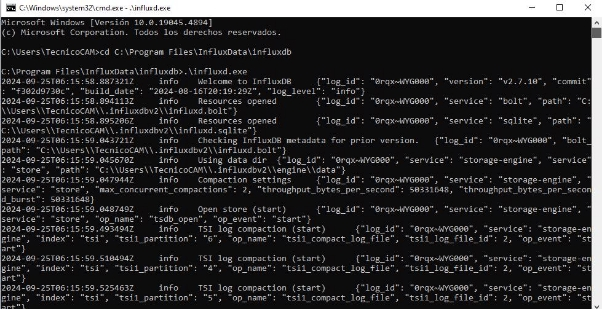

Ahora accede a tu navegador y dirígete a la dirección IP y puerto `8086`, por ejemplo: `http://192.168.0.1:8086`.

Cuando accedas por primera vez, se te pedirá que crees un usuario. Crea un usuario que usarás para iniciar sesión y configura la organización.

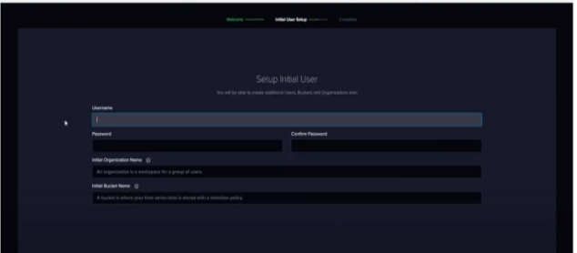

Después, crea un **Bucket** y una **API Key**. Estos se usarán en pasos posteriores. 

- Para crear un bucket, ve a la sección "Buckets" (icono de flecha hacia arriba) y selecciona "Create Bucket":

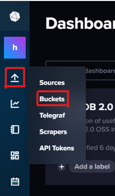

- Para crear una API Key, ve a "API Tokens" y genera un token con acceso total ("All Access"):

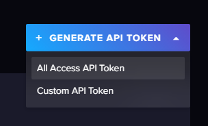

Guarda la API Key para usarla más tarde.

---

## Configuración de Node-RED con InfluxDB

1. Agrega un nodo **InfluxDB** en Node-RED desde la paleta instalada.
2. Configura los datos de conexión:
   - **URL**: `http://<tu-ip>:8086`
   - **Organización**: La configurada en InfluxDB.
   - **Bucket**: El bucket creado previamente.
   - **API Key**: El token generado.

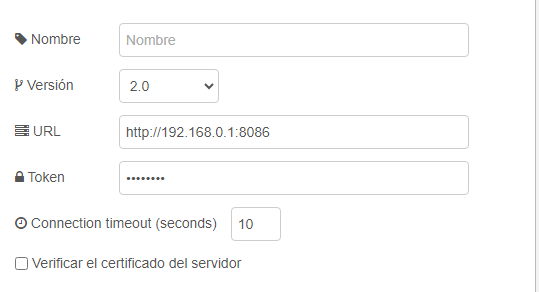

En el nodo, introduce el nombre de la medición que deseas registrar en el campo correspondiente. 

Si deseas visualizar los datos, puedes usar la funcionalidad **dashboard** de Node-RED para crear una gráfica simple que muestre la evolución en tiempo real:

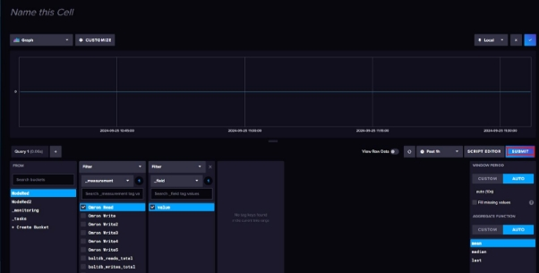

---

## Instalación de Grafana

Descargamos Grafana desde su página oficial: [Descargar Grafana](https://grafana.com/grafana/download?platform=windows). Selecciona la versión adecuada para tu sistema operativo y sigue las instrucciones de instalación:

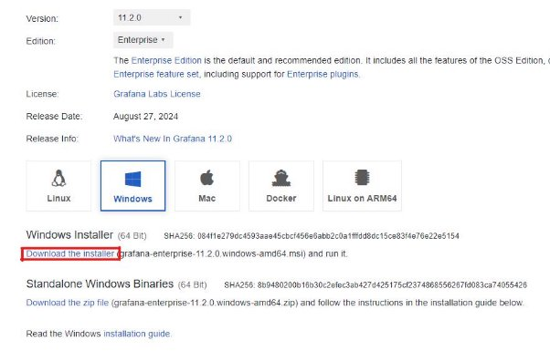

Una vez instalado, abre tu navegador y accede a `http://<tu-ip>:3000`. Por defecto, las credenciales de inicio de sesión son:
- Usuario: `admin`
- Contraseña: `admin`

Se te pedirá cambiar la contraseña al primer inicio de sesión.

---

## Configuración de Grafana con InfluxDB

1. Ve a **Data Sources** en el menú de configuración de Grafana.
2. Añade una nueva fuente de datos y selecciona **InfluxDB**.
3. Configura los detalles de conexión:
   - **URL**: `http://<tu-ip>:8086`
   - **Bucket** y **API Key**: Usa los creados en InfluxDB.
   - **Lenguaje**: Selecciona "Flux".

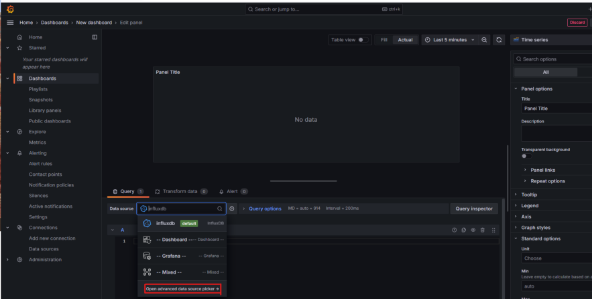  
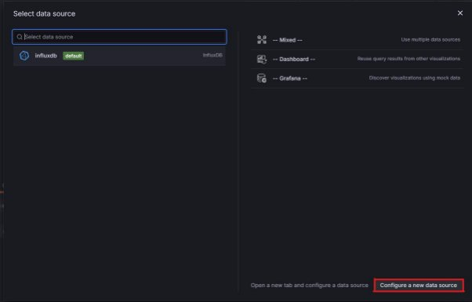

Completa la configuración y guarda los cambios. Si todo está bien, aparecerá un mensaje de prueba exitosa:

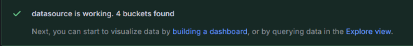

---

## Creación de Dashboards en Grafana

1. Ve a **Dashboards** y selecciona "New Dashboard".
2. Añade un panel y selecciona la fuente de datos configurada (InfluxDB).
3. Escribe el script Flux para la medición que deseas visualizar. Ejemplo:
   ```flux
   from(bucket: "tu_bucket")
     |> range(start: -1h)
     |> filter(fn: (r) => r._measurement == "tu_medición")
   ```

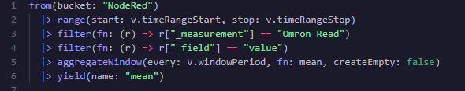

Guarda los cambios para visualizar los datos en tiempo real.

---

Siguiendo estos pasos, habrás creado una conexión funcional entre Node-RED, InfluxDB y Grafana para la visualización y monitoreo de datos.