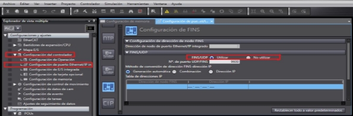

# Cómo crear una conexión por Node-RED entre un PLC NX1P2 y un S7-1200

Este documento describe los pasos para crear una conexión entre un PLC Omron NX1P2 y un PLC Siemens S7-1200 utilizando Node-RED. Sigue estos pasos detalladamente para configurar los PLCs y realizar la comunicación.

> ℹ️ **Nota**: Asegúrate de seguir cada paso de la guía para que la configuración funcione correctamente. Si usas paletas diferentes a las recomendadas, es posible que no funcionen de la misma manera.

## Tabla de Contenidos
- [Descargar Node.js y Node-RED](#descargar-nodejs-y-node-red)
- [Instalar y ejecutar Node-RED](#instalar-y-ejecutar-node-red)
- [Configuración de Node-RED](#configuracion-de-node-red)
- [Configurar el PLC Omron](#configurar-el-plc-omron)
- [Configurar el PLC Siemens](#configurar-el-plc-siemens)
- [Configurar las paletas en Node-RED](#configurar-las-paletas-en-node-red)
- [Conectar y probar la comunicación](#conectar-y-probar-la-comunicacion)

---

## Descargar Node.js y Node-RED

Primero, descarga **Node.js** desde su página oficial: [Node.js Official](https://nodejs.org/en).

Luego, descarga **Node-RED** desde su página oficial siguiendo los pasos según tu sistema operativo. En este caso, si usas **Windows**, puedes instalarlo mediante `npm` en la terminal (cmd).

Página para descargar Node-RED: [Node-RED Getting Started](https://nodered.org/docs/getting-started/local).

> ℹ️ **Nota**: Recuerda abrir una pestaña de **cmd** en tu computadora. Puedes hacerlo buscando "cmd" en el botón de inicio o pulsando **Windows + R** y escribiendo “cmd” para abrir directamente la terminal.

---

## Instalar y ejecutar Node-RED

Una vez que hayas instalado Node-RED, puedes ejecutarlo. Abre una nueva pestaña de **cmd** o usa la misma donde instalaste Node-RED, y escribe el siguiente comando para iniciar el programa:

```bash
node-red
```

---

## Configuración de Node-RED

Cuando Node-RED esté en ejecución, abre tu navegador y escribe la dirección IP que usarás para la red de los PLCs y el puerto 1880. Por ejemplo:

```
http://192.168.0.1:1880/
```

> ℹ️ **Nota**: Si usas Node-RED por primera vez, verás un ejemplo con la IP interna de tu dispositivo.


---

## Configurar el PLC Omron

1. En el PLC Omron, habilita el área de memoria DM. Para esto, ve a **Configuración de Operación** > **Configuración de Memoria**, y activa el área DM como se muestra a continuación:


2. Activa las comunicaciones FINS. Ve a **Configuración de Operación** > **Configuración de Puerto Ethernet/IP Integrado**, y activa la opción **FINS/UPD Utilizar**:



3. Crea dos variables globales para la memoria de escritura y lectura, por ejemplo: **D0** y **D1**, que estarán ubicadas en las memorias **D00** y **D01** (recuerda activarlas como **retentivas**).

---

## Configurar el PLC Siemens

1. Activa el acceso con PUT/GET en el PLC Siemens. Ve a las propiedades del PLC: **Protección y Seguridad** > **Mecanismo de Conexionado**, y activa la opción de PUT/GET.


2. Crea un **DB** (bloque de datos) con las memorias que se comunicarán con el PLC Omron. Usaremos memorias tipo **WORD**, que llamaremos **DB0** y **DB1**, igual que en el PLC de Omron.

---

## Configurar las paletas en Node-RED

Una vez configurados ambos PLCs, agrega las paletas necesarias en Node-RED para que pueda comunicarse con los PLCs:

- **Paleta Omron**: [Omron FINS](https://flows.nodered.org/node/node-red-contrib-omron-fins)
- **Paleta Siemens (Simatic)**: [Simatic S7](https://flows.nodered.org/node/node-red-contrib-s7)

### Ejemplo de conexión Node-RED

El conexionado en Node-RED debe verse de la siguiente manera:


### Configuración de las paletas de Siemens

En el siguiente ejemplo se muestran las paletas de Siemens configuradas correctamente:


### Configuración de las paletas de Omron

A continuación, se muestran las configuraciones de las paletas de Omron:

- **Lectura**:


- **Escritura**:


También se debe usar una paleta de funciones entre el nodo de lectura de Omron y la entrada de Siemens con la siguiente función:


---

## Conectar y probar la comunicación

Una vez que hayas configurado todas las paletas y conexiones, haz clic en el botón de **Instanciar** (en la parte superior derecha, recuadro rojo) para guardar la configuración y conectar los PLCs.

Para probar que la comunicación entre los PLCs se haya realizado correctamente, puedes enviar un mensaje a cada PLC y verificar que la conexión funcione como se espera.