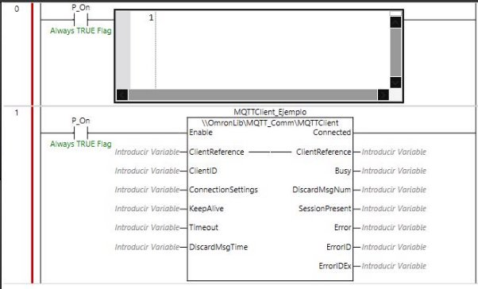
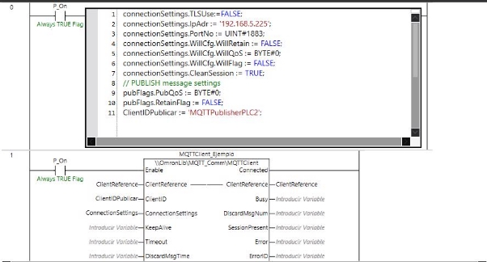
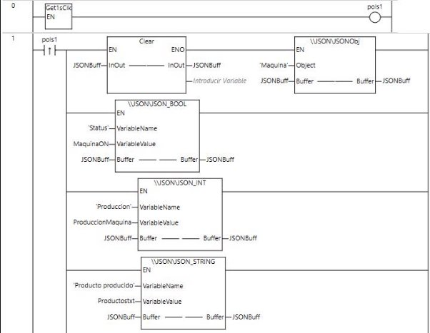
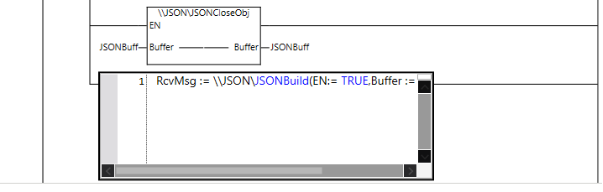
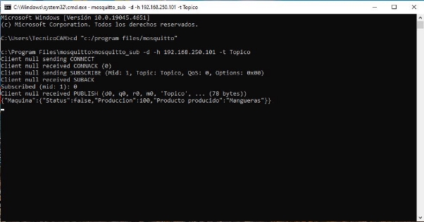

### **Cómo mandar un mensaje JSON a un servidor MQTT con PLC Omron (NX/NJ)**

1. **Preparativos Iniciales**  
   - **Descargar e instalar Mosquitto**: Obtén el software desde el sitio oficial de [Mosquitto](https://mosquitto.org/download/). Si necesitas ayuda con la instalación, consulta la guía oficial: [Guía de instalación de Mosquitto](https://mega.nz/file/cqgXxIgZ#J9VXjH-ksK2lY8pZGBSux13ciP3T1x1VDx4ucNbSwq8).  
   - **Descargar librerías JSON y MQTT**: Accede a las fuentes oficiales de Omron para obtenerlas o descárgalas directamente desde este enlace: [Librerías JSON y MQTT](https://mega.nz/folder/pzJTjQiT#SiJNguBb4uXmzAMEfDSL3Q).

---

2. **Configuración en Sysmac Studio**  
   - **Crear un programa básico**: Añade dos líneas al programa:
     - Un bloque de funciones `MQTTClient`.
     - Un bloque de texto estructural (SCL) para gestionar JSON.
     - **Nota**: Asigna nombres únicos a los bloques para evitar errores.

     

   - **Configurar el cliente MQTT**:
     - Configura las propiedades del cliente según los detalles de conexión del broker. Asegúrate de declarar todas las configuraciones como variables internas.
     - Ejemplo de configuración:  

       

---

3. **Descripción de los parámetros principales**  
   **Configuraciones del cliente MQTT**  
   | Código                            | Tipo de dato   | Función                                                                                                | Obligatorio |
   |-----------------------------------|----------------|--------------------------------------------------------------------------------------------------------|-------------|
   | `ConnectionSettings.TLSUse`       | BOOL           | Indica si se usa una comunicación segura (TRUE) o estándar (FALSE).                                   | Sí          |
   | `ConnectionSettings.IpAdr`        | STRING[201]    | Dirección IP o nombre de host del broker.                                                             | Sí          |
   | `ConnectionSettings.PortNo`       | UINT           | Número de puerto del broker (8883 para TLS, 1883 sin TLS).                                            | Sí          |
   | `ConnectionSettings.UserName`     | STRING[256]    | Nombre de usuario para autenticar la conexión.                                                        | Depende     |
   | `ConnectionSettings.Password`     | STRING[256]    | Contraseña para la autenticación.                                                                     | Depende     |
   | `ClientID`                        | STRING[256]    | Identificador único del cliente MQTT.                                                                 | Sí          |

   **Configuraciones del Publisher**  
   | Código             | Tipo de dato    | Función                                                                 | Obligatorio |
   |--------------------|-----------------|-------------------------------------------------------------------------|-------------|
   | `Topic`            | STRING[512]     | Nombre del tópico al que se publicará el mensaje.                      | Sí          |
   | `PubMsg`           | STRING[1986]    | Mensaje a publicar.                                                    | Sí          |
   | `PubSettings`      | MQTT\_CommFlags | Configuración del QoS y retención de mensajes.                         | Sí          |

   

---

4. **Creación y configuración del JSON**  
   - Crea una nueva sección en el programa para gestionar JSON:
     - Usa un bloque para construir JSON (`JSONBuild`).
     - Ejemplo de configuración:  
         
         

   **Parámetros principales del JSON**  
   | Código         | Tipo de dato    | Función                           | Obligatorio |
   |----------------|-----------------|-----------------------------------|-------------|
   | `Buffer`       | JSONBuffer      | Crea un buffer para almacenar el JSON. | Sí      |
   | `VariableName` | STRING[32]      | Nombre de la variable JSON.       | Sí          |
   | `VariableValue`| Depende del dato| Valor asignado a la variable.     | No          |

---

5. **Validación del mensaje**  
   - Ejecuta el programa y verifica que el cliente MQTT publique correctamente el mensaje en el broker.
   - El resultado en la consola (cmd) debería lucir similar a este ejemplo:  

       

Para más detalles, revisa la [documentación oficial de bloques MQTT de Omron](https://mega.nz/file/pzJTjQiT#SiJNguBb4uXmzAMEfDSL3Q).