
# Cómo Mandar un Mensaje JSON a un Servidor MQTT con PLC Omron de las Series NX/NJ

Para esta guía, usaremos el broker Adafruit, que puedes descargar buscando "adafruit" en Google o directamente desde este enlace:  
[Adafruit IO](https://io.adafruit.com/)  

---

## Descarga de Librería MQTT

Primero, descarga la librería MQTT de Omron desde la página oficial:  
[Omron Sysmac Library](https://www.ia.omron.com/product/tool/sysmac-library/)  

1. Descomprime el archivo y ejecuta el **setup** para instalar la librería.  

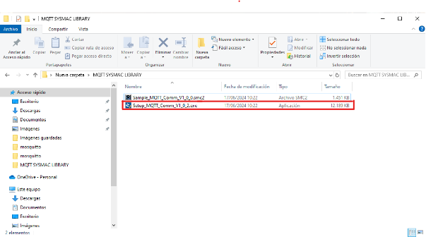

---

## Configuración en Sysmac Studio

1. Abre un nuevo proyecto en **Sysmac Studio** o utiliza uno existente.  
2. En la barra superior, selecciona **Proyecto** → **Biblioteca** → **Mostrar Referencias**.  

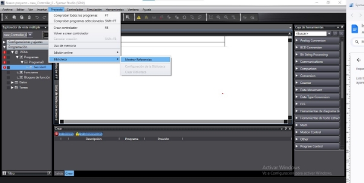

Te aparecerá la siguiente ventana:  


3. Haz clic en el botón "+" en la esquina inferior izquierda para agregar la librería descargada previamente.  
   *(Si no elegiste un destino personalizado, la ruta por defecto es: `C:\OMRON\Data\Lib\MQTT\_Comm`)*  

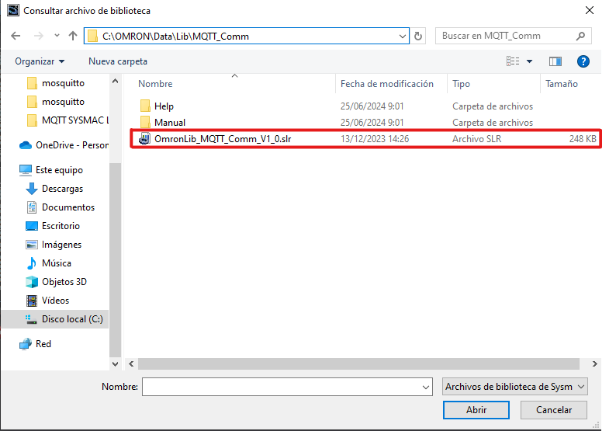

4. Tras importar la librería, estará disponible en la caja de herramientas.  
   *(Recuerda que deberás repetir este proceso cada vez que crees un nuevo documento, ya que no se guarda automáticamente).*

---

## Configuración del Programa

1. Crea dos líneas de programa:  
   - Una con **MQTTClient**.  
   - Otra con texto estructural (**SCL**).  

   Asegúrate de nombrar el bloque de funciones MQTTClient para evitar errores.  

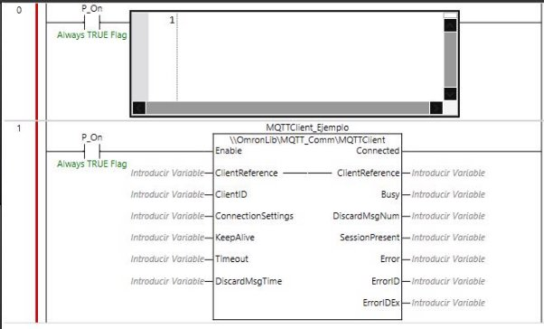

2. Configura el bloque de funciones según el ejemplo mostrado, asegurándote de definir todas las variables como internas.  

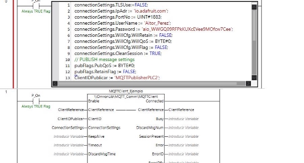

---

## Funciones de los Comandos

La siguiente tabla explica la función de cada comando en la configuración de MQTT:  

| **Código**                   | **Tipo de dato**      | **Función**                                                                                               | **¿Es obligatorio?** |
|------------------------------|-----------------------|----------------------------------------------------------------------------------------------------------|-----------------------|
| ConnectionSettings.TLSUse    | BOOL                 | Define si se utilizan comunicaciones seguras (TRUE) o no (FALSE).                                        | Sí                    |
| ConnectionSettings.TLSSessionName | STRING[17]       | Nombre de sesión TLS utilizado cuando TLSUse es TRUE.                                                    | Solo si TLSUse=TRUE   |
| ConnectionSettings.IpAdr     | STRING[201]          | Dirección IP o nombre del host del broker MQTT.                                                          | Sí                    |
| ConnectionSettings.PortNo    | UINT                 | Número de puerto del broker MQTT.                                                                        | Sí                    |
| ConnectionSettings.UserName  | STRING[256]          | Nombre de usuario para iniciar sesión en el servidor.                                                    | Solo si requerido     |
| ConnectionSettings.Password  | STRING[256]          | Contraseña para iniciar sesión en el servidor.                                                           | Solo si requerido     |
| ConnectionSettings.WillCfg   | Configuración de mensajes Will.                                                                                | No                    |
| ConnectionSettings.CleanSession | BOOL             | Define si el broker MQTT borra las suscripciones al desconectar.                                         | No                    |
| ClientID                     | STRING[256]          | Identificador único del cliente para el broker MQTT.                                                     | Sí                    |

---

## Creación de Publisher

1. Configura un publisher para enviar mensajes en formato **STRING**:  

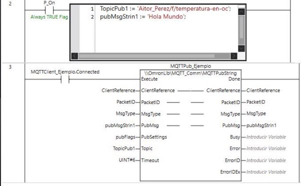

La siguiente tabla describe los comandos utilizados:  

| **Código**        | **Tipo de dato** | **Función**                                                                       | **¿Es obligatorio?** |
|--------------------|------------------|-----------------------------------------------------------------------------------|-----------------------|
| Topic             | STRING[512]     | Nombre del tópico donde publicar el mensaje.                                      | Sí                    |
| PubSettings       | Configuración QoS y Retain.                                                                         | Sí                    |
| PubMsg            | STRING[1986]    | Mensaje publicado en el tópico especificado.                                      | Sí                    |
| Timeout           | UINT            | Tiempo de espera (solo si el nivel QoS es 1 o 2).                                 | Solo si requerido     |
| PacketID          | UINT            | ID del paquete (necesario para reenvíos con QoS 1 o 2).                           | Sí                    |

---

## Creación del JSON

1. Crea una nueva sección para la parte del JSON. Configura algo similar a esto:  

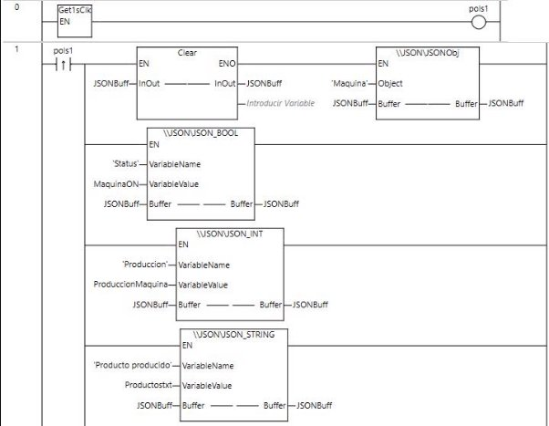  
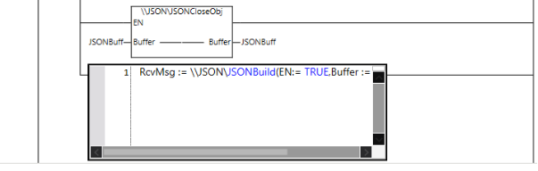

**Texto SCL**:  
```plaintext
“tu MsgPub” := \JSON\JSONBuild(EN:=TRUE, Buffer := JSONBuff);
```

| **Código**         | **Tipo de dato** | **Función**                      | **¿Es obligatorio?** |
|---------------------|------------------|----------------------------------|-----------------------|
| Buffer             | JSON\JSONBuffer | Crea un buffer para el JSON.     | Sí                    |
| Clear              | -                | Limpia el historial del buffer.  | No                    |
| Variable Name      | STRING[32]      | Nombre de la variable.           | Sí                    |
| Variable Value     | Depende         | Valor asignado a la variable.    | No                    |

---

## Configuración en Adafruit

1. Usa un navegador (en este caso, **Brave**) y busca Adafruit.  
2. Crea una cuenta haciendo clic en **Sign In**.  

  
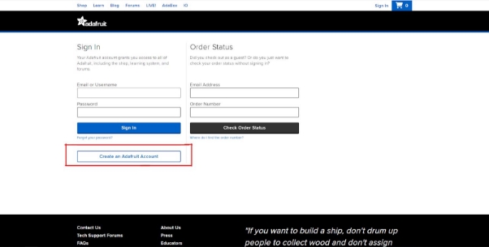

3. Ve a la pestaña **Feeds** y crea un nuevo feed.  

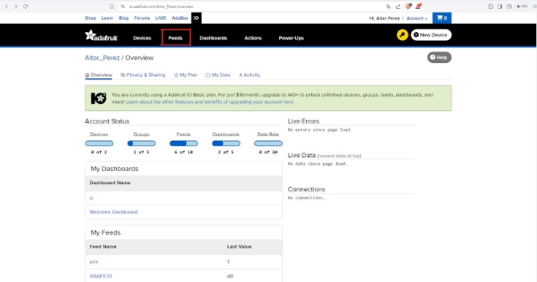  
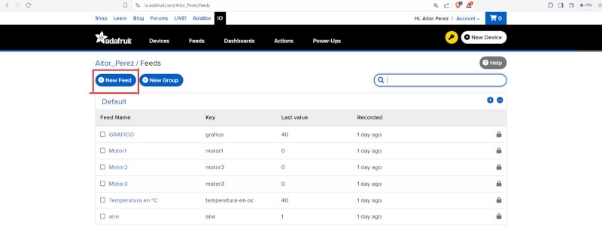  

4. Crea un dashboard y configura un stream.  

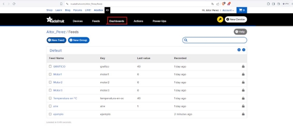  
  

---

## Configuración Final

Introduce la IP/DNS del servidor y el tópico en tu programa.  
- **DNS**: `io.adafruit.com`  
- **Tópico**: `<usuario>/<feed>`  

Ejemplo:  
Para el usuario "Aitor_Perez" y el feed "ejemplo":  
Tópico: `Aitor_Perez/f/ejemplo`

Consulta tu **Username** y **Active Key** en el icono de llave en el menú.  

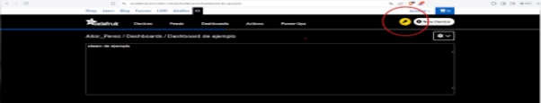

---

## Resultado

En el **CMD**, tu resultado debería verse así:  

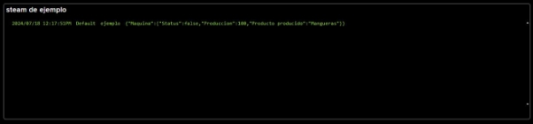

Para más información, consulta el PDF oficial de Omron:  
[Descargar PDF](https://mega.nz/folder/wmdCxIBa#kgpAYOWfCIUBnUk8OP_rnw)

