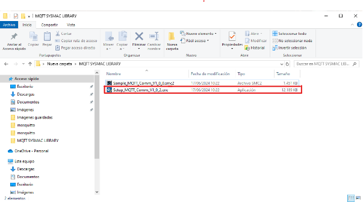

# Cómo conectar con un servidor MQTT privado con Mosquitto

Este documento detalla los pasos necesarios para configurar y conectar a un servidor MQTT privado utilizando Mosquitto.

## Tabla de Contenidos
- [Instalación de Mosquitto](#instalación-de-mosquitto)
- [Configuración Inicial](#configuración-inicial)
- [Prueba de Conexión](#prueba-de-conexión)
- [Configuración Avanzada](#configuración-avanzada)
- [Integración con Sysmac Studio](#integración-con-sysmac-studio)

---

## Instalación de Mosquitto

### Descargar e instalar Mosquitto
1. Descarga Mosquitto desde su página oficial (elige la versión adecuada para tu sistema operativo, 32 o 64 bits):  
   [https://mosquitto.org/download/](https://mosquitto.org/download/)

2. Instala Mosquitto utilizando la ruta predeterminada recomendada.

### Verificar instalación
1. Abre el menú de inicio de Windows y busca **Servicios**.
2. Localiza el servicio llamado **Mosquitto broker**.
3. Haz doble clic y presiona **Iniciar** si no está en ejecución.

     
   

---

## Configuración Inicial

### Abrir terminal (cmd)
1. Abre una ventana de **cmd** desde el menú de inicio o presionando `Windows+R` y escribiendo `cmd`.
2. Navega a la carpeta de instalación de Mosquitto:
   ```bash
   cd "C:/Program Files/mosquitto"
   ```

### Configurar **Subscribe** y **Publisher**
1. En una ventana de cmd:
   ```bash
   mosquitto_sub -d -t topico_ejemplo
   ```
2. En otra ventana de cmd:
   ```bash
   mosquitto_pub -h localhost -t topico_ejemplo -m "mensaje de prueba"
   ```
3. Verifica que el mensaje del publisher aparezca en la ventana del subscriber.

     

> ℹ️ Para conocer más comandos disponibles, ejecuta:  
> `mosquitto -h`

---

## Configuración Avanzada

### Editar archivo `mosquitto.conf`
1. Abre el archivo `mosquitto.conf` en la carpeta de instalación.
2. Localiza el apartado **PSK based SSL/TLS support** (puedes usar `Ctrl+F` para buscar más rápido).
3. Agrega las siguientes líneas:
   ```plaintext
   listener 1883
   allow_anonymous true
   ```
4. Guarda los cambios (si no puedes, guarda en el escritorio y reemplaza el archivo original).

### Configuración del firewall
1. Abre el **Firewall de Windows Defender** y selecciona **Configuración avanzada**.
   

2. Crea nuevas reglas de entrada y salida para el puerto 1883:
   - Tipo: **Puerto**.
   - Número de puerto: **1883**.
   - Permitir conexión.
   - Nombre: **mosquitto_regla_entrada** (y luego otra para salida).

3. Reinicia el equipo y repite la prueba con el publisher y subscriber, esta vez usando la IP del equipo:
   ```bash
   mosquitto_pub -h 192.168.5.225 -t topico_ejemplo -m "mensaje de prueba"
   ```

   

---

## Integración con Sysmac Studio

### Descargar librería MQTT
1. Descarga la librería desde la página oficial de Omron:  
   [https://www.ia.omron.com/product/tool/sysmac-library/](https://www.ia.omron.com/product/tool/sysmac-library/)

2. Instala la librería descargada.

   

### Importar librería en Sysmac Studio
1. Abre un nuevo documento o proyecto en Sysmac Studio.
2. Navega a **Proyecto > Biblioteca > Mostrar Referencias**.
3. Importa la librería desde su ubicación predeterminada:
   ```plaintext
   C:\OMRON\Data\Lib\MQTT_Comm
   ```

     
   

4. Configura el cliente MQTT utilizando bloques de funciones, tal como se muestra a continuación:

     
   

### Crear Publisher y Subscriber
1. Define un publisher con las siguientes configuraciones:  
   

2. Consulta el PDF oficial de Omron para ejemplos más avanzados:  
   [https://mega.nz/folder/wmdCxIBa#kgpAYOWfCIUBnUk8OP_rnw](https://mega.nz/folder/wmdCxIBa#kgpAYOWfCIUBnUk8OP_rnw)

---

**Nota**: Si tienes dudas o problemas, revisa la documentación oficial o el video guía proporcionado:  
[https://www.youtube.com/watch?v=4CIUBtMNnKU](https://www.youtube.com/watch?v=4CIUBtMNnKU)  

¡Gracias por seguir este tutorial!
