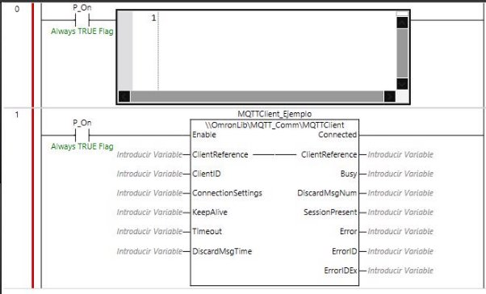
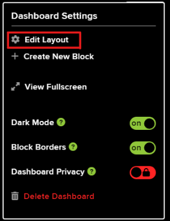

### **Cómo conectar con un servidor MQTT online con Adafruit**

1. **Descargar la librería MQTT de Omron**  
   - Accede a la página oficial de Omron y descarga la librería desde: [Sysmac Library](https://www.ia.omron.com/product/tool/sysmac-library/).  
   - Después de descargar la librería, descomprime el archivo e inicia el setup para instalarla.  

     

---

2. **Importar la librería en Sysmac Studio**  
   - Abre un nuevo proyecto en Sysmac Studio o un programa existente.  
   - En la barra superior, selecciona **Proyecto** → **Biblioteca** → **Mostrar Referencias**.  

     

   - Aparecerá una ventana como la siguiente:  

     

   - Haz clic en el botón "+" (esquina inferior izquierda).  
   - Busca la carpeta donde se instaló la librería (por defecto en: `C:\OMRON\Data\Lib\MQTT_Comm`).  

     

   - Una vez importada y aceptada, la librería estará disponible en la caja de herramientas. **Nota**: Este paso se debe realizar cada vez que se cree un nuevo proyecto.  

---

3. **Crear el programa en Sysmac Studio**  
   - Crea dos líneas de programa: una con el bloque `MQTTClient` y otra con texto estructural (SCL).  
   - Asigna nombres únicos a cada bloque para evitar errores.  

     

   - Configura el bloque `MQTTClient`. Define todas las configuraciones como variables internas.  

     

---

4. **Parámetros de configuración del cliente MQTT**  

   **Configuraciones principales**  
   | Código                             | Tipo de dato | Función                                                                                         | Obligatorio |
   |------------------------------------|--------------|-------------------------------------------------------------------------------------------------|-------------|
   | `ConnectionSettings.TLSUse`        | BOOL         | Habilita comunicaciones seguras (TRUE) o estándar (FALSE).                                      | Sí          |
   | `ConnectionSettings.TLSSessionName`| STRING[17]   | Nombre de la sesión TLS, requerido si `TLSUse=TRUE`.                                            | Solo si TLS |
   | `ConnectionSettings.IpAdr`         | STRING[201]  | Dirección IP o nombre de host del broker MQTT.                                                  | Sí          |
   | `ConnectionSettings.PortNo`        | UINT         | Puerto del broker (8883 para TLS, 1883 sin TLS).                                                | Sí          |
   | `ConnectionSettings.UserName`      | STRING[256]  | Nombre de usuario para autenticar la conexión.                                                 | Según broker|
   | `ConnectionSettings.Password`      | STRING[256]  | Contraseña para la autenticación.                                                              | Según broker|

   **Configuraciones avanzadas**  
   | Código                             | Tipo de dato | Función                                                                                         | Obligatorio |
   |------------------------------------|--------------|-------------------------------------------------------------------------------------------------|-------------|
   | `ConnectionSettings.CleanSession`  | BOOL         | Indica si el broker debe mantener la sesión tras la desconexión.                                | No          |
   | `ClientID`                         | STRING[256]  | Identificador único del cliente MQTT.                                                          | Sí          |
   | `KeepAlive`                        | UINT         | Tiempo de mantenimiento de la conexión con el broker MQTT.                                      | No          |
   | `Timeout`                          | UINT         | Tiempo máximo para la conexión inicial.                                                        | No          |

---

5. **Configurar un Publisher**  
   - Crea un Publisher con las siguientes configuraciones:  

     

   **Parámetros principales del Publisher**  
   | Código         | Tipo de dato   | Función                                                                 | Obligatorio |
   |----------------|----------------|-------------------------------------------------------------------------|-------------|
   | `Topic`        | STRING[512]    | Nombre del tópico para publicar.                                       | Sí          |
   | `PubMsg`       | STRING[1986]   | Mensaje a publicar en el tópico especificado.                          | Sí          |
   | `PubSettings`  | MQTT_PubFlags  | Configuración de QoS y retención de mensajes.                          | Sí          |

---

6. **Configurar una cuenta en Adafruit**  
   - Abre [Adafruit IO](https://io.adafruit.com/) en tu navegador (en este ejemplo, Brave).  
   - Regístrate en la pestaña **Sign in** para crear una cuenta.  

       
     

---

7. **Crear Feeds y Dashboards en Adafruit**  
   - Accede a la sección **Feeds** y crea uno nuevo en **New Feed**.  

       
     

   - Luego, ve a **Dashboards**, crea un nuevo Dashboard y configúralo según tus preferencias.  

       
     

---

8. **Configurar el Dashboard y Bloques**  
   - Accede al Dashboard creado y selecciona **Create New Block** en el menú de configuración.  
   - Elige el tipo de bloque (por ejemplo, **Stream**) y configúralo con la feed previamente creada.  

       

   - Ajusta el diseño y guarda los cambios.  

     

---

9. **Configurar las credenciales MQTT en Sysmac Studio**  
   - El DNS del servidor de Adafruit es siempre `io.adafruit.com`.  
   - El tópico se compone de tu nombre de usuario seguido de `/f/` y el nombre de tu feed, por ejemplo: `Usuario/f/Ejemplo`.  
   - Para obtener tu usuario y clave (Active Key), haz clic en el ícono de la llave en el panel superior derecho de Adafruit IO.  

     

---

Si tienes dudas o necesitas más información, consulta el [PDF oficial de bloques MQTT de Omron](https://mega.nz/folder/wmdCxIBa#kgpAYOWfCIUBnUk8OP_rnw).