# Cómo Conectar Correctamente un M1 a un PLC NX102

En esta guía, usaremos los siguientes dispositivos:  
- Variador **3G3M1-A4007**  
- PLC **NX102-9020**  
- Tarjeta **PF0730**  
- CPU de seguridad **SL 3300**  
- Tarjeta **SID800**  

---

## Configuración del Bastidor

En el bastidor, colocamos los dispositivos en la siguiente disposición:  

Conectamos el variador al PLC mediante **EtherCAT**. Asegúrate de que los nodos están correctamente configurados tanto en el software como en el hardware. En este ejemplo, usamos un **3G3M1**.

---

## Configuración de la CPU de Seguridad

1. Ve a la CPU de seguridad y selecciona la tarjeta de entradas en los parámetros.
2. Asigna nombres a las entradas para el botón de paro y el botón de reinicio:
   - Botón de paro: **EStop**  
   - Botón de reinicio: **Reset Button**  

   *(Nota: Aunque el botón de paro tiene dos interruptores, basta con nombrar uno).*

La configuración se verá de esta manera:  

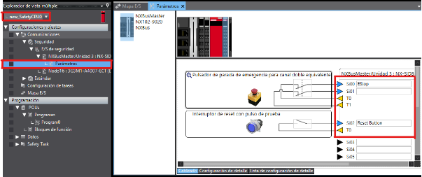

El cableado real debería lucir similar a esto:  

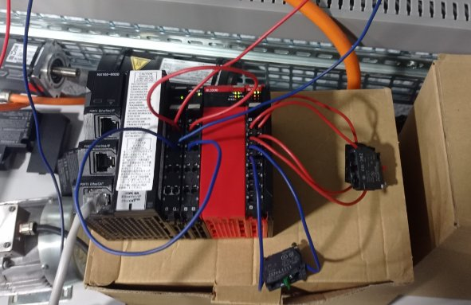

---

## Modificación del Mapa de PDOs del Variador

1. Ve al PLC y accede a la configuración de EtherCAT.  
2. Selecciona el botón **Configuración de Asignación**.

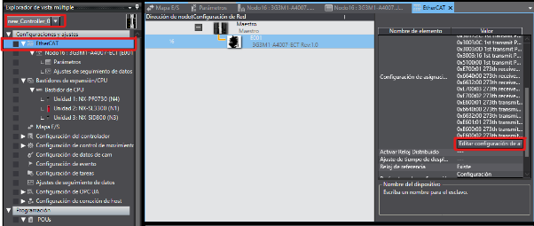

Asigna los parámetros del mapa de PDOs según las siguientes imágenes:

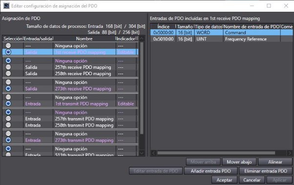  
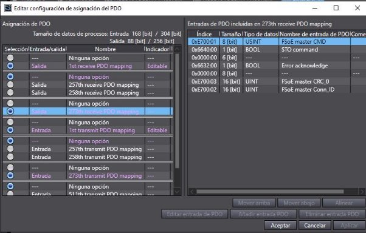  
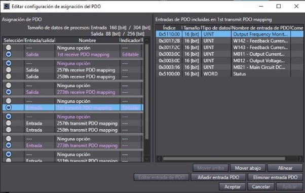  
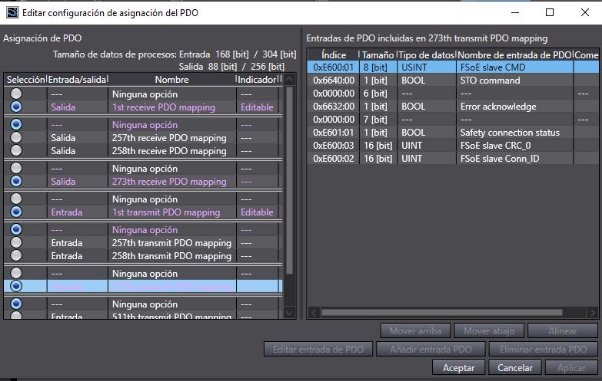  

---

## Configuración del Mapa de Entradas/Salidas en la CPU de Seguridad

En el mapa de entradas/salidas de la CPU de seguridad, configura los valores según esta imagen:  

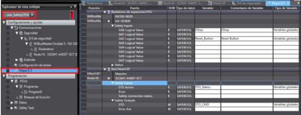

---

## Programación de la CPU de Seguridad

En la sección de programación de la CPU de seguridad, añade el siguiente bloque:  

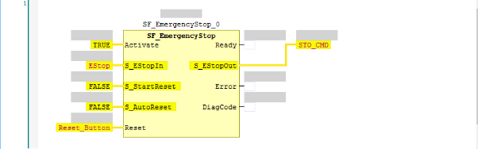

---

## Configuración de Parámetros FSoE

1. Ve a **Parámetros** y busca el número **H483**.
2. Asigna la dirección **FSoE** deseada (en este ejemplo, usamos el valor `3`).  
   *(Asegúrate de que no interfiera con otras configuraciones).*

3. Comprueba que la dirección coincida con la de la CPU de seguridad.  

Ejemplo de configuración:  

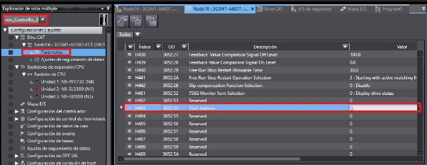  
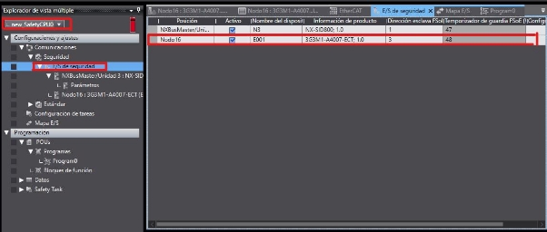

---

## Referencia Adicional

Si encuentras problemas al seguir esta guía, puedes consultar este tutorial en video:  
[Guía en YouTube](https://www.youtube.com/watch?v=lT8H641sjLI)
