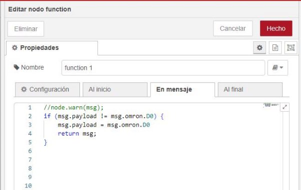

Aquí tienes el contenido reorganizado de manera similar al ejemplo que proporcionaste, sin cambiar el contenido original:

```
# Conexión por Node-RED entre un PLC NX1P2 y un S7-1200

Este directorio contiene un ejemplo de cómo crear una conexión por Node-RED entre un PLC Omron NX1P2 y un PLC Siemens S7-1200 para la comunicación de datos mediante el protocolo FINS y PUT/GET. Se utiliza un flujo en Node-RED para gestionar la conexión y las comunicaciones entre ambos PLCs.

> ℹ️ **Nota**: Este proyecto está diseñado y probado específicamente para los PLC Omron NX1P2 y Siemens S7-1200. Puede requerir ajustes para otros modelos o configuraciones de PLC.

## Tabla de Contenidos
- [Introducción](#introducción)
- [Contenido del Directorio](#contenido-del-directorio)
- [Instalación](#instalación)
  - [Configuración del Entorno](#configuración-del-entorno)
  - [Configuración de Node-RED](#configuración-de-node-red)
  - [Configuración de los PLCs](#configuración-de-los-plcs)
- [Uso del Proyecto](#uso-del-proyecto)
  - [Conexión entre PLCs](#conexión-entre-plcs)
  - [Pruebas](#pruebas)
- [Licencia](#licencia)

## Introducción
El objetivo de este ejemplo es mostrar cómo conectar y configurar un PLC Omron NX1P2 y un PLC Siemens S7-1200 para que se comuniquen entre sí a través de Node-RED, utilizando las paletas específicas para cada PLC.

## Contenido del Directorio

La estructura del directorio es la siguiente:

```
ConexiónNodeRED/
├── flows/
│   └── flujo_plcs.json            # Flujos de Node-RED para conectar ambos PLCs
├── images/
│   └── Step1.jpeg                 # Imágenes de la configuración de Node-RED
│   └── Step2.jpeg                 # Imágenes de configuración de PLC Omron
│   └── Step3.jpeg                 # Imágenes de configuración de PLC Siemens
└── README.md                      # Documentación principal del proyecto
```

## Instalación

### Configuración del Entorno
1. **Descargar Node.js**:
   - Descargue Node.js desde su página oficial: [https://nodejs.org/en](https://nodejs.org/en).

2. **Instalar Node-RED**:
   - Instale Node-RED según las instrucciones de su página oficial: [https://nodered.org/docs/getting-started/local](https://nodered.org/docs/getting-started/local).

   > ⚠️ **Advertencia**: Asegúrese de elegir el paquete adecuado según el sistema operativo de su computadora (en este ejemplo se utilizará Windows).

3. **Iniciar Node-RED**:
   - Una vez instalado, inicie Node-RED ejecutando el comando `node-red` en la terminal.

### Configuración de Node-RED
1. **Acceder a la interfaz de Node-RED**:
   - Abra su navegador y acceda a la interfaz de Node-RED en la dirección IP correspondiente del PLC y puerto 1880. Por ejemplo: `http://192.168.0.1:1880/`.

2. **Instalar las paletas necesarias**:
   - Instale las siguientes paletas para poder comunicar con ambos PLCs:
     - **Paleta de Omron**: [https://flows.nodered.org/node/node-red-contrib-omron-fins](https://flows.nodered.org/node/node-red-contrib-omron-fins)
     - **Paleta de Simatic**: [https://flows.nodered.org/node/node-red-contrib-s7](https://flows.nodered.org/node/node-red-contrib-s7)

### Configuración de los PLCs

#### PLC Omron NX1P2
1. **Configurar área de memoria DM**:
   - En el PLC Omron, habilite el área de memoria DM, accediendo a “Configuración de Operación” > “Configuración de Memoria” > activando el área DM.

   

2. **Activar comunicaciones FINS**:
   - Vaya a “Configuración de Operación” > “Configuración de puerto Ethernet/IP integrado” y active las comunicaciones FINS/UPD.

   

3. **Crear variables globales**:
   - Cree las variables globales para la memoria de escritura y lectura (por ejemplo, "D0" y "D1").

#### PLC Siemens S7-1200
1. **Activar acceso PUT/GET**:
   - En el PLC Siemens, habilite el acceso PUT/GET en “Protección y seguridad” > “Mecanismo de conexionado”.

   

2. **Crear un DB**:
   - Cree un bloque de datos (DB) para almacenar las variables que se comunicarán con el PLC Omron, usando memorias tipo WORD (por ejemplo, DB0 y DB1).

## Uso del Proyecto

### Conexión entre PLCs
Con los PLCs configurados y Node-RED preparado, cree un flujo en Node-RED que conecte ambos PLCs, utilizando los nodos específicos para Omron y Siemens.

1. **Conexión de Inputs y Outputs**:
   - El flujo de Node-RED debe conectar las salidas del PLC Omron con las entradas del PLC Siemens, usando los nodos de lectura y escritura apropiados.

   

2. **Configuración de las paletas**:
   - Configure las paletas de Omron y Siemens según las imágenes siguientes:

   
   

   Para la lectura en Omron:

   
   

   Para la escritura en Omron:

   
   

3. **Usar una paleta de funciones**:
   - Entre la lectura de Omron y la entrada de Siemens, utilice una paleta de funciones para transformar los datos correctamente.

   

### Pruebas
Una vez todo esté configurado, ejecute el flujo en Node-RED y verifique que los datos se transfieren correctamente entre los PLCs. Puede realizar una prueba enviando un mensaje entre los PLCs y visualizando el resultado en la consola de depuración.

> ✅ **Tip**: Asegúrese de que las configuraciones de IP y puerto sean correctas en ambos PLCs antes de realizar las pruebas.

## Licencia
Este proyecto está licenciado bajo la Licencia **Creative Commons Attribution-NonCommercial-NoDerivatives (CC BY-NC-ND)**. Esto significa que:
- Puedes compartir el contenido, siempre que se atribuya correctamente al autor.
- **No se permite el uso comercial** de los materiales.
- **No se pueden realizar obras derivadas** basadas en este contenido.