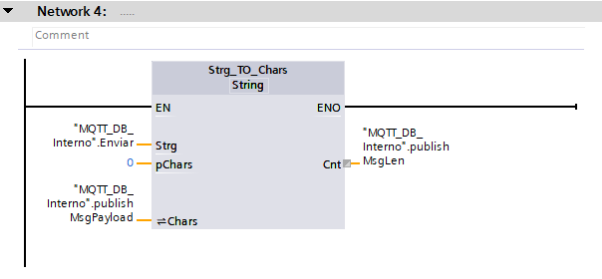

Claro, aquí tienes el contenido en formato de texto que puedes copiar directamente:

```markdown
# Cómo conectar con un servidor MQTT privado con Mosquitto

Este tutorial muestra cómo conectar con un servidor MQTT privado utilizando Mosquitto. A continuación, se explican los pasos detallados para instalar y configurar Mosquitto en Windows, comprobar su funcionamiento y conectarse a través de TIA Portal.

## Tabla de Contenidos
- [Introducción](#introducción)
- [Instalación de Mosquitto](#instalación-de-mosquitto)
- [Comprobación de la instalación](#comprobación-de-la-instalación)
- [Configuración de Mosquitto en CMD](#configuración-de-mosquitto-en-cmd)
- [Configuración de la red y firewall](#configuración-de-la-red-y-firewall)
- [Prueba con Publisher y Subscriber](#prueba-con-publisher-y-subscriber)
- [Configuración de Mosquitto en TIA Portal](#configuración-de-mosquitto-en-tia-portal)
- [Licencia](#licencia)

## Introducción

En este tutorial, aprenderás a conectar un servidor MQTT privado utilizando Mosquitto en Windows. Se detallan los pasos necesarios desde la instalación hasta la configuración para interactuar con TIA Portal y realizar pruebas de comunicación.

## Instalación de Mosquitto

1. **Descargar Mosquitto:**
   - Primero, descarga Mosquitto desde su página oficial. Asegúrate de seleccionar la versión correcta para tu sistema operativo (32 o 64 bits):
   - [Descargar Mosquitto](https://mosquitto.org/download/)

2. **Instalación:**
   - Una vez descargado, instala Mosquitto. Se recomienda dejar la ruta de instalación predeterminada.

## Comprobación de la instalación

1. **Acceder a los servicios del sistema:**
   - Ve al menú de inicio de Windows y escribe "Servicios" para abrir la ventana de servicios del sistema.
   - Busca un servicio llamado "Mosquitto broker". Si no está en ejecución, haz clic en él y presiona "Iniciar".

   

2. **Iniciar Mosquitto Broker:**
   - Si el servicio no se está ejecutando, haz doble clic y presiona "Iniciar".

   

## Configuración de Mosquitto en CMD

1. **Abrir CMD:**
   - Abre la ventana de CMD desde el menú de inicio o presiona Windows+R y escribe `cmd`.

2. **Acceder a la carpeta de Mosquitto:**
   - Cambia a la carpeta donde instalaste Mosquitto, por ejemplo:
   ```
   cd "C:/Program Files/Mosquitto"
   ```

3. **Crear ventanas CMD adicionales:**
   - Abre una nueva ventana de CMD usando el comando `start` o abre otra ventana y repite el paso anterior.

4. **Configurar el Subscriber:**
   - En la primera ventana de CMD, escribe el siguiente comando para suscribirte a un tema:
   ```
   mosquitto_sub -d -t topico_ejemplo
   ```

5. **Configurar el Publisher:**
   - En la segunda ventana, escribe el siguiente comando para publicar un mensaje:
   ```
   mosquitto_pub -h localhost -t topico_ejemplo -m "mensaje de prueba"
   ```

6. **Verificar el mensaje:**
   - El mensaje publicado debería aparecer en la ventana de suscripción. Si no ves el mensaje, revisa los pasos anteriores y asegúrate de seguirlos correctamente.

   Si prefieres una guía visual, puedes seguir el siguiente video:
   - [Video tutorial](https://www.youtube.com/watch?v=4CIUBtMNnKU)

   

## Configuración de la red y firewall

1. **Modificar el archivo `mosquitto.conf`:**
   - Abre el archivo `mosquitto.conf` ubicado en la carpeta de instalación de Mosquitto y busca la sección llamada “PSK based SSL/TLS support”.
   - Añade las siguientes líneas:
   ```
   listener 1883
   allow_anonymous true
   ```

2. **Guardar los cambios:**
   - Si no puedes guardar el archivo directamente, guarda el archivo en el escritorio y luego reemplaza el archivo original en la carpeta de Mosquitto.

3. **Configurar el firewall de Windows:**
   - Abre el firewall de Windows desde el menú de inicio y selecciona “Configuración avanzada”.
   - Crea una nueva regla de entrada para el puerto 1883 y asegúrate de permitir la conexión.
   - Haz lo mismo para las reglas de salida.
   - Reinicia el sistema después de hacer estos cambios.

   

## Prueba con Publisher y Subscriber

1. **Verificación de la comunicación:**
   - Después de reiniciar el sistema, prueba de nuevo con el Publisher y Subscriber, pero esta vez usa la IP de tu máquina. Para obtener la IP, escribe `ipconfig` en CMD.

   Un ejemplo de cómo se vería la prueba utilizando la IP local:
   

## Configuración de Mosquitto en TIA Portal

1. **Preparar el entorno de TIA Portal:**
   - En TIA Portal, descarga la librería MQTT de Simatic desde la página oficial de Siemens:
     - [Librerías para Simatic](https://support.industry.siemens.com/cs/document/109780503/libraries-for-communication-for-simatic-controllers?dti=0&lc=en-ES)

2. **Importar la librería MQTT:**
   - Abre TIA Portal y ve a la opción "Librería". Carga la librería descargada.

   

3. **Configuración de los bloques MQTT:**
   - Dentro de la librería importada, ve a la carpeta “LMQTT” y selecciona el bloque “LMQTT_Client”.

   

4. **Configurar las entradas y salidas:**
   - Relaciona las entradas y salidas del bloque con sus contrapartes del DB, tal como se muestra en la siguiente imagen:

   

   Además, añade los segmentos necesarios.

   
   

5. **Configurar segmentos adicionales:**
   - Crea un segmento adicional para configurar correctamente la comunicación MQTT.

   

## Licencia

Este proyecto está licenciado bajo la Licencia **Creative Commons Attribution-NonCommercial-NoDerivatives (CC BY-NC-ND)**. Esto significa que:
- Puedes compartir el contenido, siempre que se atribuya correctamente al autor.
- **No se permite el uso comercial** de los materiales.
- **No se pueden realizar obras derivadas** basadas en este contenido.