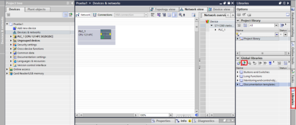

# Cómo conectar con un servidor MQTT online con Adafruit

> ℹ️ **Nota**: Este tutorial está diseñado para configuraciones con TIA Portal V19 y un PLC Siemens S7-1200. Ajusta las instrucciones según tu entorno de trabajo.

## Tabla de Contenidos
- [Introducción](#introducción)
- [Descarga de la Librería MQTT](#descarga-de-la-librería-mqtt)
- [Configuración en TIA Portal](#configuración-en-tia-portal)
  - [Importar la Librería](#importar-la-librería)
  - [Configurar el Bloque MQTT Client](#configurar-el-bloque-mqtt-client)
  - [Conexión de Entradas y Salidas](#conexión-de-entradas-y-salidas)
  - [Segmentos Adicionales](#segmentos-adicionales)
- [Parámetros del Bloque](#parámetros-del-bloque)
- [Configuración en Adafruit](#configuración-en-adafruit)
  - [Crear una Cuenta](#crear-una-cuenta)
  - [Crear un Feed](#crear-un-feed)
  - [Configurar un Dashboard](#configurar-un-dashboard)
- [Conexión del PLC al Servidor MQTT](#conexión-del-plc-al-servidor-mqtt)
- [Referencias Adicionales](#referencias-adicionales)

## Introducción
Este tutorial describe cómo configurar una conexión MQTT entre un PLC Siemens y un servidor online de Adafruit utilizando la librería MQTT de Siemens. El objetivo es enviar datos desde el PLC a un feed de Adafruit y visualizarlos en un dashboard.

---

## Descarga de la Librería MQTT
Primero, descarga la librería MQTT desde el sitio oficial de Siemens compatible con tu versión de TIA Portal. [Enlace de descarga aquí.](https://support.industry.siemens.com/cs/document/109780503)

---

## Configuración en TIA Portal

### Importar la Librería
1. Abre **TIA Portal**.
2. Ve a la sección **Librerías** (icono de libro con una flecha verde).
3. Selecciona el archivo descargado de la librería y cárgalo al proyecto.

   

### Configurar el Bloque MQTT Client
1. Dentro de la librería, abre la carpeta `LMQTT` y selecciona `LMQTT_Client`.
2. Arrastra el bloque `FB` al programa del PLC.

   

### Conexión de Entradas y Salidas
Conecta las entradas y salidas del bloque con los parámetros correspondientes del DB como se muestra:

   

### Segmentos Adicionales
Añade los segmentos requeridos para enviar y recibir datos.

   - **Segmento de envío**: Configura el envío de datos.
     
   - **Segmento general**: Configura la inicialización.
     

---

## Parámetros del Bloque

| Nombre              | Tipo       | Tipo de Data          | Descripción                                                                                   |
|---------------------|------------|-----------------------|-----------------------------------------------------------------------------------------------|
| **enable**          | Input      | Bool                  | `TRUE`: Establece y mantiene la conexión. `FALSE`: Conexión rota.                             |
| **publish**         | Input      | Bool                  | Publica el mensaje en el feed configurado.                                                   |
| **subscribe**       | Input      | Bool                  | Se suscribe al tópico especificado.                                                          |
| **retain**          | Input      | Bool                  | Define si los datos se envían con la bandera "retain".                                        |
| **qos**             | Input      | USInt                 | Nivel de Calidad de Servicio (QoS): 0, 1 o 2.                                                |
| **valid**           | Output     | Bool                  | `TRUE`: Bloque funcionando sin errores.                                                      |
| **status**          | Output     | Word                  | Código de estado y error.                                                                    |
| **connParam**       | InOut      | `LMQTT_typeConnParam` | Parámetros de conexión al servidor MQTT.                                                     |

---

## Configuración en Adafruit

### Crear una Cuenta
1. Ve a [Adafruit IO](https://io.adafruit.com/) y crea una cuenta.
2. Inicia sesión en la plataforma.

   

### Crear un Feed
1. Accede a la sección **Feeds**.
2. Haz clic en **New Feed** y crea un feed con el nombre deseado.

   

### Configurar un Dashboard
1. Ve a la sección **Dashboards** y selecciona **New Dashboard**.
2. Diseña tu dashboard agregando bloques visuales, como `Stream`.

   

---

## Conexión del PLC al Servidor MQTT
1. Configura el bloque MQTT en TIA Portal con los siguientes datos:
   - **Servidor**: `io.adafruit.com`
   - **Usuario**: Tu nombre de usuario de Adafruit.
   - **Contraseña**: Tu clave activa (Active Key).
   - **Tópico**: `<Usuario>/f/<Nombre del Feed>`

2. Verifica que la conexión se establezca correctamente.

---

## Referencias Adicionales
Para más detalles, consulta el [PDF oficial](https://mega.nz/folder/hygSxYIZ#nCYbpJVOV0Q0RaLuluCMSw).

> ⚠️ **Nota**: Asegúrate de seguir todas las instrucciones según la versión de tu software y hardware.